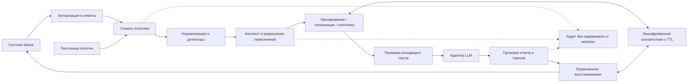

# Проектирование системы

## Продукт и границы

Рабочее название — Alpha Privacy Gateway. Один переиспользуемый модуль между системами банка
и LLM: обнаруживает чувствительные фрагменты, применяет политику потребителя, передаёт
обработанный запрос и восстанавливает разрешённые значения в ответе.
Для хакатона выбираем модульный монолит: проще запустить и показать, меньше сетевых переходов.
Python + FastAPI — стартовый стек; менять язык или выделять сервис NER будем по профилю нагрузки,
а не ради архитектурной сложности. Redis понадобится для общего TTL-хранилища при нескольких репликах.
Правила начинаются с версионированного конфига, отдельная БД управления на первом этапе не нужна.

## Целевая схема (не всё реализовано)

В текущем коде есть авторизация, конфиг, интерфейс `Detector`, 17 базовых типов детекции, токенизатор,
локальный `MemoryVault`, восстановление, JSON-аудит и метрики. Путь `/process` по умолчанию использует
этот быстрый локальный vault и пул из 16 CPU-воркеров, поэтому обработка не блокирует event loop.
Для нескольких uvicorn workers доступен `SQLiteVault`: WAL, Fernet-шифрование и атомарная запись
по хешу `payload_id` сохраняют связь маски и восстановления между процессами.
Добавлены контракт `LLMProvider`, `/v1/proxy` и базовый выходной контроль. `local-echo` — явный имитатор LLM.
Целевые интерфейсы: `Detector`, `PolicyRepository`, `Transformer`, `MappingVault`,
`LLMAdapter`, `AuditSink`. Не дробим их на микросервисы на старте.

## Распознавание и сохранение смысла

1. Быстрые правила и проверки контрольных цифр: номера, контакты, документы.
2. Локальный NER и контекстные классификаторы: ФИО, адреса, органы выдачи, гражданство.
3. Единое разрешение пересечений: длинный адрес не должен конфликтовать с номером дома,
   дата выдачи — с датой рождения, номер документа — с телефоном.
4. Нормализация регистра, Unicode, пробелов и разделителей с отображением позиций на исходный текст.
   Исходный текст не нормализуется при восстановлении.
5. Калиброванные пороги и контекстные правила определяют действие: защитить, пропустить или отклонить
   неоднозначный запрос. Порог риска измеряем на отложенном наборе; не называем эвристику гарантией.

Имена публичных персонажей и адреса отделений нельзя исключать глобальным белым списком.
«Поэт Александр Пушкин» и «клиент Александр Пушкин, паспорт…» требуют разных решений.
Справочник офисов должен подтверждать именно контекст офиса. Дату без контекста нельзя автоматически
называть датой рождения; неоднозначность форматов сохраняем, не переинтерпретируем при восстановлении.

## Преобразования и ответ модели

- Основной режим — типизированные непрозрачные токены: модель видит роль сущности, но не её значение.
  Токены привязаны к системе и сессии; повторные сущности в целевой версии получают стабильную идентичность
  внутри сессии. Сейчас каждое вхождение имеет собственный токен для точного roundtrip.
- Классическая маска сохраняет длину и пунктуацию. Восстановление по позициям допустимо только для
  неизменённого маскированного документа с проверкой целостности; для ответа LLM нужны токены.
- Синтетика — дополнительный режим, не обязательный для зачёта токенизации, но полезный для NLP-сценариев.
  Использовать явно вымышленные значения, избегать случайных реальных контактов, проверять коллизии.

Точное восстановление оригинала и восстановление токенов в перефразированном ответе — разные проверки.
LLM может удалить, повторить, переставить или испортить токены: восстанавливаем только точные разрешённые
токены, неизвестные и повреждённые отклоняем, по сходству ничего не угадываем. Удалённые моделью данные
не восстанавливаем искусственно. Новые ПД в ответе проходят выходной контроль до восстановления.
Стриминг в первом полноценном демо выключен: нельзя выпустить начало ПД до завершения проверки.

## Политики

Целевая политика: `system_id`, `version`, `enabled`, `detect_types`, `protect_types`,
`mode_by_type`, `restore_enabled`, `ttl`, `combination_rules`, `context_exceptions`.
Детектирование отделяем от преобразования: иначе нельзя обнаружить комбинацию с незащищаемым типом.
Комбинации проверяем в пределах одной сущности/локального контекста, не всего длинного документа.
Пример дополнительного сценария: PIN защищается только рядом с CARD; настройка показывается на
синтетических данных, безопасный профиль по умолчанию защищает секреты и поодиночке.
Разрешение выключить маскирование не должно незаметно открыть отправку внешнему провайдеру:
политика выхода отдельно блокирует незащищённые категории либо разрешает только локальный маршрут.
Снимок версии политики сохраняется на весь запрос; публикация изменений атомарная.

## Своя фишка: песочница политик с оценкой регрессий

Пользователь — владелец банковской системы или специалист ИБ. Перед включением новых правил
он сравнивает текущую и предложенную политику на размеченном синтетическом наборе своих сценариев.
Экран показывает изменения: исправленные пропуски, новые пропуски, ложные маски, потери смысла
на прикладной задаче, latency; затем открывает безопасные примеры и причины решения детектора.
При регрессии по критическим категориям публикация блокируется; откат возвращает предыдущую версию.

Польза: меньше ручного согласования и повторной разработки, быстрее подключение новых команд,
меньше риска ухудшить рабочие сценарии после изменения правил. Измеряем время настройки нового
потребителя, число предотвращённых регрессий и качество прикладной задачи до/после обработки.
Не выдаём количество найденных сущностей за «предотвращённые утечки»: нужны эталонные метки.
Не выдаём успешный прогон набора за доказательство отсутствия любых утечек.
Это гипотеза отличия, а не проверенное утверждение об отсутствии аналогов у конкурентов.

Минимальное демо фишки: новая политика ошибочно исключает имя клиента вместе с именем поэта;
сравнение ловит регрессию и запрещает публикацию. Исправленная контекстная политика проходит.
На первом срезе фишка спроектирована, реализация начинается после стабильного конвейера.

## Безопасность и сбои

- При недоступности обязательного детектора, хранилища или политики не отправляем исходный текст в LLM.
  Разрешённый fallback — локальное необратимое маскирование только когда это явно допускает политика.
- Соответствия шифруются и живут ограниченное время. В прототипе ключ случайный на процесс,
  шифротекст в памяти; в целевой версии внешнее управление ключами, общий TTL-store и принудительное удаление.
- TTL прототипа запрещает доступ после срока, но физическая очистка ленивая, при следующей операции.
  Гарантированное затирание Python-строк в памяти не обеспечивается.
- Авторизация проверяет владельца и актуальное разрешение на восстановление. Далее — mTLS/RBAC,
  отдельные административные полномочия, квоты, ограничение размера тела до JSON-парсинга.
- Аудит: случайный request_id, версия политики, этап, типы/количества, длительности, код ошибки.
  Никаких текстов, исходных значений, ключей или хешей ПД; типы метрик имеют ограниченную кардинальность.
- Защита не является фильтром всех prompt injection: недоверенный текст никогда не определяет права
  восстановления, хранилище, политику или адрес провайдера.
- Соответствие законодательству и внутренним стандартам не заявляем по прототипу: для пилота нужен
  отдельный разбор с ИБ банка. Внешнюю LLM включаем после проверки полного конвейера на синтетическом наборе.

## Производительность

Рабочая цель — p95 <= 500 мс на обработку короткого запроса при 1000 RPS, расширенная — 2000 RPS.
Выбор p95 — наша конкретизация: документы не задают процентиль. Показываем также p50/p99 и ошибки.
Задержка LLM и полная задержка запроса учитываются отдельно. Профиль нагрузки, железо, число реплик,
размеры текстов, доля сущностей и длительность теста обязательны в отчёте.
100 000 токенов — отдельный профиль крупных запросов с ограничением конкуренции, временем и памятью;
не подразумеваем, что 2000 таких документов в секунду проверены тем же тестом.
После выбора токенизатора считаем TPS по настоящему числу токенов, а не по символам/4.
Для NER предусматриваем прогрев, ограниченный пул, разбиение с перекрытием и склейку по абсолютным
позициям; сущности на границах чанков входят в тесты. Второй проход тем же детектором не доказывает
отсутствия пропусков: выходной контроль дополняет, но не заменяет оценку качества на датасете.

Актуальные изменения хранения `/process`, точных границ масок и измеренные ограничения: [устойчивость](resilience.md).
